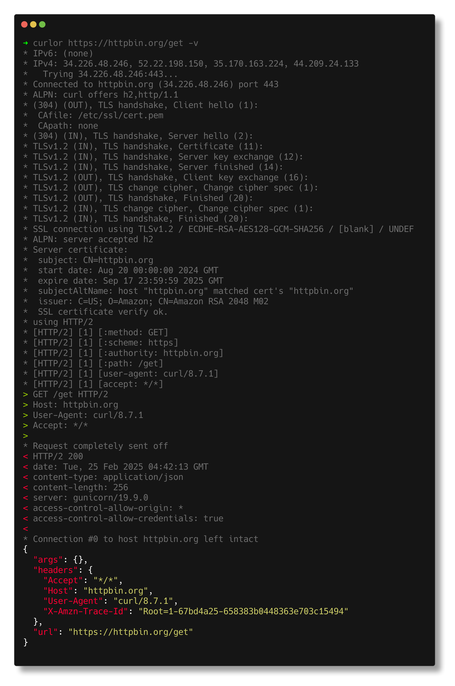

## 📖 Introduction

`curlor` is a tool to color curl's output. It will automatically determine the highlighting style of the response body. 

Thanks to the power of [chroma](https://github.com/alecthomas/chroma), `curlor` can better support more response formats and more highlight themes. 

> If you find that some responses are supposed to be colored but aren't, please let me know via issue.

## 🚀 Features:

- Keep the curl original output formatted.
- Automatically determine the highlighting format for the response body.
- Support more than 50 formats, such as json, yaml, html, etc.
- Support other theme.

## 🎊 Preview





## 📌 Roadmap

- [ ] support package manager
- [ ] add more formats
- [ ] add help info for usage

## 🧰 Install

``` shell
go install github.com/if-nil/curlor/cmd/curlor@latest
```

## 🔨️ Build

``` shell
git clone https://github.com/if-nil/curlor
cd curlor/cmd/curlor
go build -o curlor
```